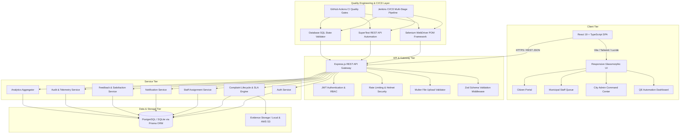
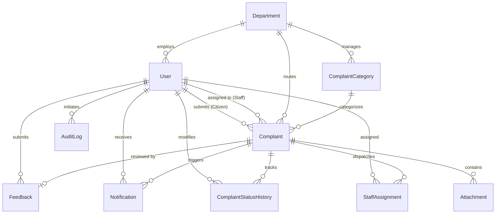
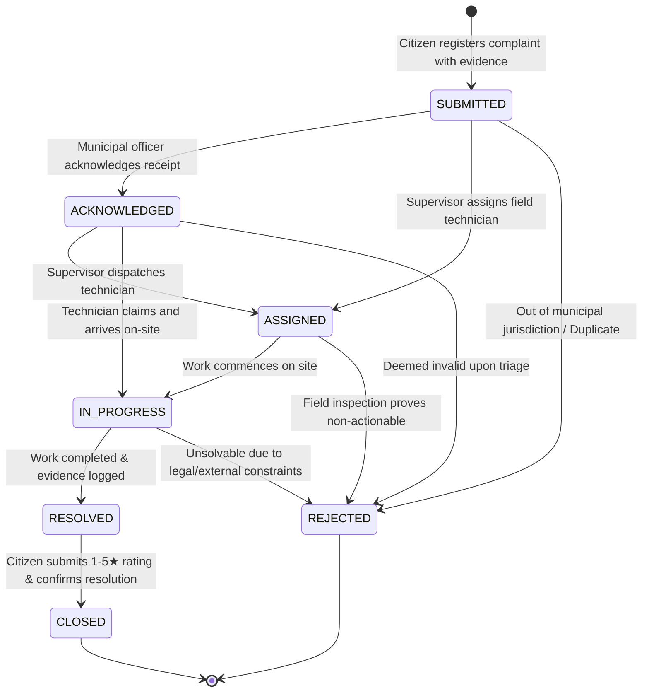

# CitizenCare — System Architecture & Technical Specification

## 1. High-Level System Architecture

CitizenCare is built as a cloud-native, layered full-stack application backed by an enterprise Quality Engineering and test automation ecosystem.

---

## 2. Relational Database Schema (ERD)

---

## 3. Complaint State Machine Lifecycle

---

## 4. SLA Computation & Deadline Engine

Each category is bound to a strict Service Level Agreement:

| Priority Level | SLA Target | Formula | Action on Expiry |
| :--- | :--- | :--- | :--- |
| **CRITICAL** | **24 Hours** | `CreatedAt + 24 Hours` | Overdue Alert + Supervisor Escalation |
| **HIGH** | **48 Hours** | `CreatedAt + 48 Hours` | Overdue Flag in Staff Queue |
| **MEDIUM** | **72 Hours** | `CreatedAt + 72 Hours` | Prioritized in Backlog |
| **LOW** | **7 Days (168h)** | `CreatedAt + 168 Hours`| Standard Route Work Order |

---

## 5. Security & Isolation Architecture

1. **Authentication:** Stateless JSON Web Tokens (JWT) signed with HMAC SHA-256 and expiration policies.
2. **Password Hashing:** Industry-standard `bcryptjs` with 10 salt rounds. Plaintext passwords never stored or logged.
3. **RBAC Isolation:** Middleware guards ensure Citizens can only access their own private complaints, while Staff and Admin have scoped department and city-wide capabilities.
4. **Input Sanitization & Injection Immunity:** Prisma ORM parameterized queries eliminate SQL injection vulnerabilities. Zod validates request payloads at the gate.
5. **File Evidence Security:** Restricts upload extensions to `.jpg`, `.png`, `.webp`, `.pdf`, limits size to 5MB, and sanitizes filenames using random UUIDs to prevent directory traversal attacks.
