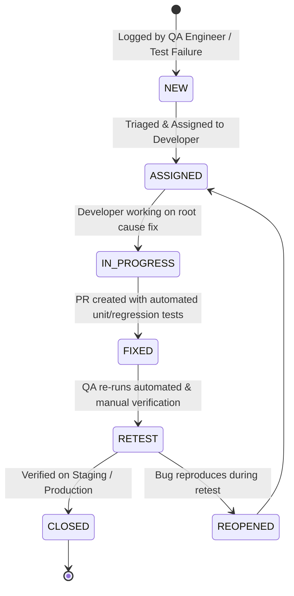

# Defect Classification & Triage Catalog

## 1. Severity Classification Matrix

| Severity Level | Definition | Response SLA | Resolution SLA | Escalation Target |
| :--- | :--- | :--- | :--- | :--- |
| **Severity 1 (Critical / Blocker)** | System crash, data loss, security bypass, or broken complaint submission preventing public safety reporting. | < 15 Minutes | < 4 Hours | Lead Architect + VP Engineering |
| **Severity 2 (Major / High)** | SLA calculation failure, file upload validation error, or in-app notification failure on critical tickets. | < 1 Hour | < 24 Hours | Staff SDET + Module Lead |
| **Severity 3 (Medium)** | UI misalignment, filter dropdown lag, or non-blocking validation tooltip wording issue. | < 4 Hours | Next Sprint | Frontend / QA Engineer |
| **Severity 4 (Low / Trivial)** | Spacing inconsistency, badge color contrast tweak, or minor documentation typo. | < 1 Day | Backlog | Product Designer / QA |

---

## 2. Enterprise Defect Lifecycle State Machine

